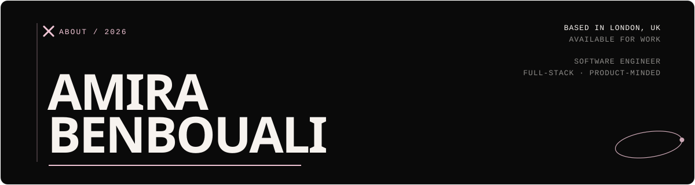

<p align="center">
  
</p>


### 01 / about

there's a particular quiet that happens somewhere between an idea and its first working version. that's usually where you'll find me.

i'm a computer science graduate who likes understanding how things work, then building my own version to check.

my work sits somewhere between **software engineering, product and design**. i'm especially interested in systems that are thoughtfully engineered *and* enjoyable to actually use.

most days: building something, breaking it, figuring out why, making the next version a little better.

<br clear="right">

---

### 02 / selected work

**◌ atria** · *calendar, without the friction.*
a calm, interaction-focused planning system for events, tasks and everyday organisation.

`react` `typescript` `zustand` `motion`

↳ **[explore the project →](https://github.com/amirabenbouali/atria)**

<br>

**◐ metronome** · *the city, scored in real time.*
a live pulse dashboard for london that fuses real-time traffic, transit, weather and event data into a single score for every borough.

`fastapi` `postgis` `react` `typescript`

↳ **[explore the project →](https://github.com/amirabenbouali/metronome)**

<br>

**✦ foundry** · *engineering work, made visible.*
an operating system for domains, issues, triage and postmortems, the parts of engineering that usually live in five different tabs.

`next.js` `typescript` `postgresql` `prisma`

↳ **[explore the project →](https://github.com/amirabenbouali/foundry)**

<br>

**⌘ kansodb** · *from text, to execution.*
a small SQL query engine, built to see exactly what happens between a query going in and a result coming out.

`query parsing` `execution` `databases` `typescript`

↳ **[explore the project →](https://github.com/amirabenbouali/kansodb)**

<br>

**↗ mini ci/cd** · *pipelines, watched from the inside.*
a lightweight CI/CD system, built to see how automation actually behaves once it's running.

`ruby` `bash` `automation` `ci/cd`

↳ **[explore the project →](https://github.com/amirabenbouali/miniCI)**

---

### 03 / toolbox

what i reach for, roughly in order of muscle memory:

```text
languages     →  typescript · javascript · python · sql · ruby
frontend      →  react · next.js · css
backend       →  node.js · postgresql · prisma · fastapi · postgis
engineering   →  git · github actions · testing · ci/cd
learning      →  terraform · cloud infrastructure · distributed systems
```

---

### 04 / currently

a rough snapshot, updated whenever it stops being true:

```text
building      a handful of things at once
exploring     terraform + infrastructure
learning      system design
thinking      about what makes software feel good to use
```

---

### 05 / elsewhere

`↗` **linkedin** · [linkedin.com/in/amirabenbouali](https://www.linkedin.com/in/amirabenbouali)
`↗` **more projects** · [github.com/amirabenbouali?tab=repositories](https://github.com/amirabenbouali?tab=repositories)

<br>

<sub>
built with curiosity, too many browser tabs, and a coffee that's gone cold nearby. ✦
</sub>
